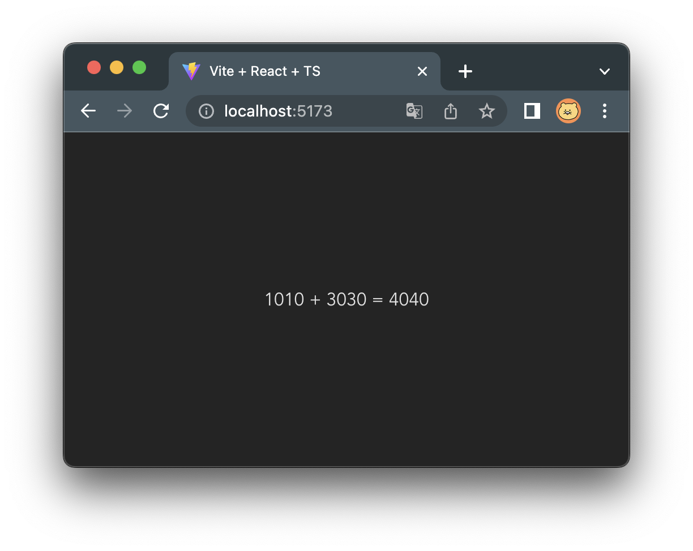

# vite-wasm-demo

## Installation
```bash
yarn install
```

## Preliminaries
1. Setup Rust compiler
- See https://www.rust-lang.org/tools/install
2. Build wasm plugin
    ```bash
    yarn build:wasm
    ```

## Playground
Run Vite dev
```bash
yarn dev
```
